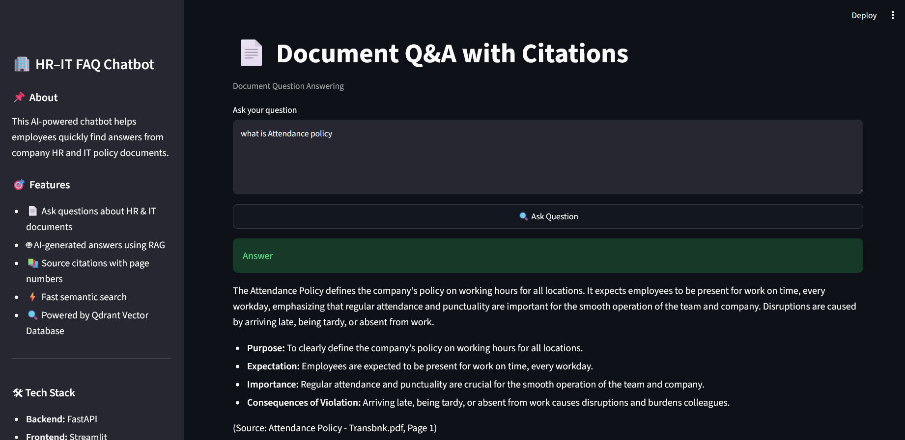

# 📄 HR–IT FAQ Chatbot using RAG (Retrieval-Augmented Generation)

An AI-powered HR–IT FAQ Chatbot built using **FastAPI**, **Streamlit**, **LangChain**, **Gemini 2.5 Flash**, and **Qdrant**.

The chatbot allows employees to ask questions about HR and IT policy documents in natural language and receives accurate answers with **source citations**, reducing manual document searching.

---

## 🚀 Features

- 📄 Ask questions from HR & IT policy documents
- 🤖 AI-generated answers using Gemini 2.5 Flash
- 🔍 Retrieval-Augmented Generation (RAG)
- 📚 Source citations with document name and page number
- ⚡ Semantic search using Qdrant Vector Database
- 🌐 FastAPI REST APIs
- 💻 Streamlit Web Interface
- 🔄 Automatic PDF ingestion and indexing
- ❌ Hallucination prevention (answers only from retrieved documents)
- 📑 Document comparison (`/contradict` endpoint)

---

# 🏗 System Architecture

```text
                    User
                      │
                      ▼
            Streamlit Frontend
                      │
                      ▼
                FastAPI Backend
                      │
          ┌───────────┴───────────┐
          ▼                       ▼
      Retriever              Gemini 2.5 Flash
          │
          ▼
     Qdrant Vector DB
          ▲
          │
Embeddings (BAAI/bge-small-en-v1.5)
          ▲
          │
PDF Loader → Chunking → Indexing
```

---

# ⚙️ Tech Stack

| Component | Technology |
|------------|------------|
| Language | Python |
| Backend | FastAPI |
| Frontend | Streamlit |
| LLM | Gemini 2.5 Flash |
| Framework | LangChain |
| Vector Database | Qdrant |
| Embedding Model | BAAI/bge-small-en-v1.5 |
| PDF Loader | PyPDFLoader |
| Chunking | RecursiveCharacterTextSplitter |

---

# 📁 Project Structure

```text
potens-intern-aiml-harsh-shinde/

├── api.py
├── app.py
├── config.py
├── ingest.py
├── README.md
├── requirements.txt
├── .env.example
│
├── data/
│   └── documents/
│
├── screenshots/
│
├── src/
│   ├── api/
│   ├── chunking/
│   ├── embeddings/
│   ├── llm/
│   ├── loaders/
│   ├── prompts/
│   ├── retrieval/
│   ├── services/
│   ├── ui/
│   ├── utils/
│   └── vectordb/
```

---

# ⚙️ Installation

Clone the repository

```bash
git clone https://github.com/<your-username>/potens-intern-aiml-harsh-shinde.git

cd potens-intern-aiml-harsh-shinde
```

Create a virtual environment

```bash
python -m venv venv
```

Activate the environment

Windows

```bash
venv\Scripts\activate
```

Install dependencies

```bash
pip install -r requirements.txt
```

---

# 🔑 Environment Variables

Create a `.env` file.

```env
GOOGLE_API_KEY=YOUR_GOOGLE_API_KEY

QDRANT_URL=YOUR_QDRANT_URL

QDRANT_API_KEY=YOUR_QDRANT_API_KEY

COLLECTION_NAME=document_qa
```

---

# 📄 Add Documents

Place all HR and IT policy PDF files inside

```text
data/documents/
```

---

# 📚 Index Documents

Run

```bash
python ingest.py
```

This will

- Load PDFs
- Split into chunks
- Generate embeddings
- Create Qdrant collection (if required)
- Store document vectors

---

# ▶️ Run Backend

```bash
uvicorn api:app --reload
```

Swagger Documentation

```
http://127.0.0.1:8000/docs
```

---

# 💻 Run Streamlit

```bash
streamlit run src/ui/streamlit_app.py
```

---

# 📌 API Endpoints

## Health Check

```
GET /health
```

---

## Ask Question

```
POST /ask
```

Request

```json
{
    "question":"What is the Exit Policy?"
}
```

---

## Compare Documents

```
POST /contradict
```

Request

```json
{
    "topic":"Exit Policy",
    "document_1":"Exit Policy.pdf",
    "document_2":"Employee Handbook.pdf"
}
```

---

# 🧠 Chunking Strategy

The documents are split using **RecursiveCharacterTextSplitter**.

- Chunk Size: **1000**
- Chunk Overlap: **200**

This strategy preserves context across chunks while improving retrieval accuracy and reducing the chance of losing important information during semantic search.

---

# 🚫 Hallucination Prevention

The chatbot only answers using retrieved document chunks.

If the required information is unavailable, it responds that the answer could not be found in the provided documents instead of generating unsupported information.

---

# 📷 Screenshots

## Home Page



---

## Question Answering

_Add screenshot here_

---

## Citations

_Add screenshot here_

---

## Swagger API

_Add screenshot here_

---

## Qdrant Dashboard

_Add screenshot here_

---

# 📈 Future Improvements

- Confidence score for responses
- Role-based authentication
- OCR support for scanned PDFs
- Hybrid Search (Dense + BM25)
- Multi-document upload from UI
- Conversation memory
- Docker deployment
- Kubernetes deployment

---

# 🤖 AI Tools Used

| Tool | Purpose |
|------|----------|
| ChatGPT | Architecture planning, debugging, code explanations, documentation |
| Gemini | LLM for question answering |

---

# 👨‍💻 Author

**Harsh Shinde**

Bachelor of Engineering (Artificial Intelligence & Machine Learning)

GitHub: https://github.com/harshshinde9890

LinkedIn: https://www.linkedin.com/in/harsh-shinde-44519626a

---

# 📜 License

This project was developed as part of the **Potens AI/ML Internship Assignment 2026**.